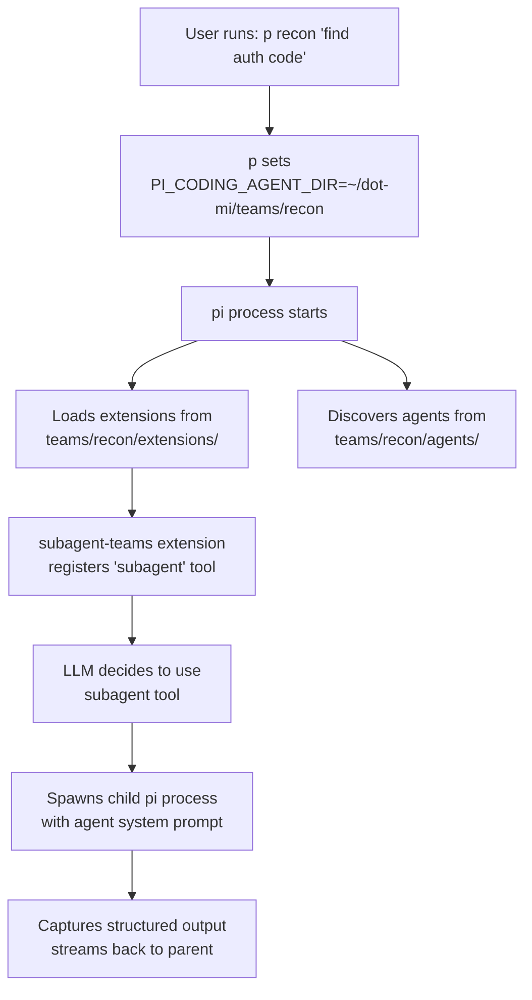
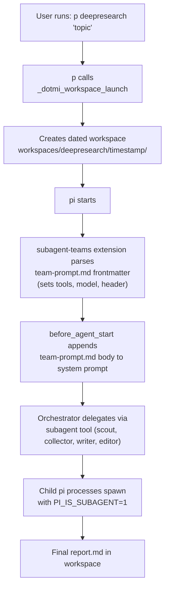
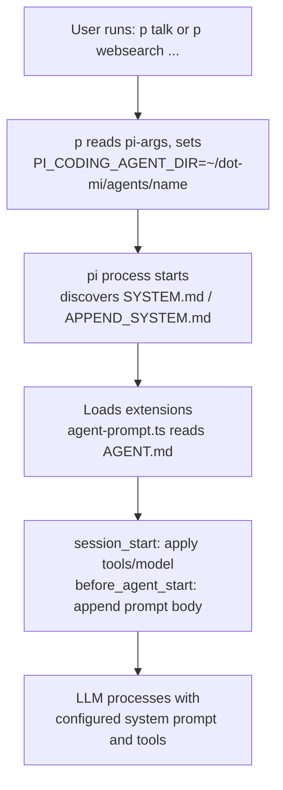

# Architecture

## The PI_CODING_AGENT_DIR Mechanism

pi resolves its config root via `getAgentDir()` in the coding-agent package. This function checks the `PI_CODING_AGENT_DIR` environment variable first. When set, **all** of pi's configuration loads from that directory instead of `~/.pi/agent/`:

- `extensions/` -- auto-discovered TypeScript extensions
- `agents/` -- agent definition markdown files
- `prompts/` -- prompt template files
- `skills/` -- skill definitions (SKILL.md files)
- `bin/` -- downloaded tool binaries (fd, rg)
- `sessions/` -- conversation history
- `settings.json` -- pi settings
- `models.json` -- custom model providers
- `auth.json` -- API authentication
- `team-prompt.md` -- orchestrator config and system prompt (YAML frontmatter parsed by the subagent-teams extension for name, description, tools, model; body appended to system prompt)
- `workspace.conf` -- workspace subdirectory list (triggers workspace mode in bash_aliases)

This is the mechanism dot-mi exploits for both team isolation and standalone agent configurations.

## Directory Layout

```
dot-mi/
├── setup.sh                  # Team and agent bootstrapping script
├── bash_aliases              # Shell functions (source in .zshrc/.bashrc)
├── example.env               # API key template
├── AGENTS.md                 # LLM-readable project guide
├── shared/                   # Reusable resources (never loaded directly)
│   ├── extensions/           # Shared extension source code
│   ├── skills/               # Shared skill definitions (SKILL.md files)
│   ├── themes/               # Shared themes (JSON)
│   ├── bin/                  # Downloaded binaries (fd, rg) -- gitignored contents
│   └── models.json           # Custom model provider config
├── teams/                    # Multi-agent team directories (one per team)
│   └── <name>/               # Each is a complete PI_CODING_AGENT_DIR root
│       ├── extensions/       # ← symlinks to shared/extensions/
│       ├── agents/           # Subagent definitions (<name>-agentname.md)
│       ├── prompts/          # Prompt templates (slash-command workflows)
│       ├── skills/           # ← individual symlinks to shared/skills/
│       ├── themes/           # ← individual symlinks to shared/themes/
│       ├── team-prompt.md    # Orchestrator config (frontmatter) + system prompt (body)
│       ├── banner.txt        # Startup branding (ASCII art + usage)
│       ├── workspace.conf    # (optional) Triggers workspace mode (dated directories)
│       ├── bin/              # ← symlink to shared/bin/
│       ├── sessions/         # Runtime (gitignored)
│       ├── settings.json     # Theme, quietStartup (gitignored)
│       └── models.json       # ← symlink to shared/models.json
├── agents/                   # Standalone agent directories (one per agent)
│   └── <name>/               # Each is a complete PI_CODING_AGENT_DIR root
│       ├── extensions/       # Custom extension (+ shared symlinks)
│       ├── skills/           # ← individual symlinks to shared/skills/
│       ├── themes/           # ← individual symlinks to shared/themes/
│       ├── banner.txt        # Startup branding (ASCII art + usage)
│       ├── bin/              # ← symlink to shared/bin/
│       ├── sessions/         # Runtime (gitignored)
│       └── models.json       # ← symlink to shared/models.json
├── docs/                     # This documentation (MkDocs)
└── references/               # Reference submodules
    ├── pi-mono/              # Read-only upstream pi source
    └── qmd/                  # Additional reference (see .gitmodules)
```

## Data Flow



### Workspace Team Flow



### Standalone Agent Flow



See [Standalone Agents](standalone-agents.md) for details.

## Team-Level Configuration

### `team-prompt.md` -- Orchestrator Config and System Prompt

The `subagent-teams` extension parses `team-prompt.md` YAML frontmatter at startup, then applies configuration on `session_start`. The markdown body is appended to the orchestrator's system prompt via a `before_agent_start` hook.

```yaml
---
name: Deep Research
description: Search, collect, synthesize, report.
tools: read, find, ls, grep
model: plebchat/qwen/qwen3-coder-next
---

# Deep Research Team

You are the orchestrator for a deep research team...
```

| Field | Effect |
|-------|--------|
| `name` | Rendered as a bold accent header at startup |
| `description` | Rendered below the name in dim text |
| `tools` | Comma-separated tool whitelist for the orchestrator. The `subagent` tool is always included automatically. Omit to keep all default tools. |
| `model` | `provider/modelId` format. Sets the orchestrator's model on session start. Omit to use the default. |

All frontmatter configuration is gated on `PI_IS_SUBAGENT` -- subagent child processes do not receive team-level configuration. This works correctly for both interactive sessions and non-interactive runs.

## Extension Architecture

The `subagent-teams` extension extends the upstream `subagent` example with team-based filtering:

### Agent Discovery

Agents are markdown files with YAML frontmatter. They're discovered from `<agentDir>/agents/` at each invocation. Teams are derived from:

1. **Filename convention**: `team-agentname.md` (first `-` separates team from name)
2. **Frontmatter override**: a `team` field takes precedence over filename

### Execution Modes

| Mode | Input | Behavior |
|------|-------|----------|
| **Single** | `{ agent, task }` | One agent runs one task |
| **Parallel** | `{ tasks: [...] }` | Up to 8 tasks, 4 concurrent |
| **Chain** | `{ chain: [...] }` | Sequential pipeline; `{previous}` passes output forward |

### Prompt Templates

Prompt templates (`.md` files in `prompts/`) define reusable workflows. They can reference `$@` as a placeholder for user input and are invoked with `/template-name` syntax in the pi chat.

## Isolation Model

Each team and standalone agent directory is a complete pi config root. This provides:

- **Extension isolation** -- each team loads only its own extensions
- **Agent isolation** -- only the team's agents are visible to the LLM
- **Skill isolation** -- per-team via individual symlinks, per-agent via frontmatter (`skills`, `no-skills`)
- **Session isolation** -- separate conversation history per team
- **Settings isolation** -- per-team model preferences and configuration

Shared resources (extensions, skills, themes, models, binaries) are symlinked from `shared/` to avoid duplication while preserving isolation boundaries. Downloaded binaries (`fd`, `rg`) are written once to `shared/bin/` through directory symlinks and shared across all teams automatically. Individual agents can further restrict which skills they load via frontmatter. Orchestrator tools can be restricted per-team via the `tools` field in `team-prompt.md` frontmatter (e.g. restricting to `read,find,ls,grep` to force subagent delegation).

For shared authentication across teams and agents, symlink `auth.json`:

```bash
./setup.sh link-auth recon blog
./setup.sh link-auth recon twenty-questions
```
