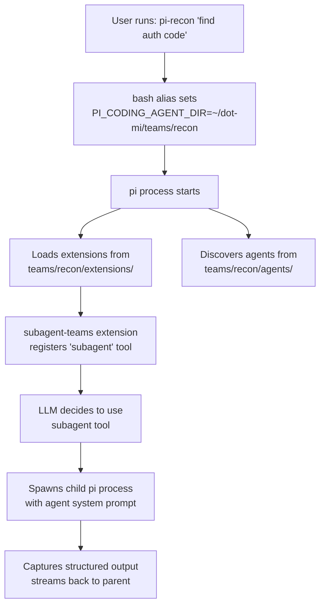
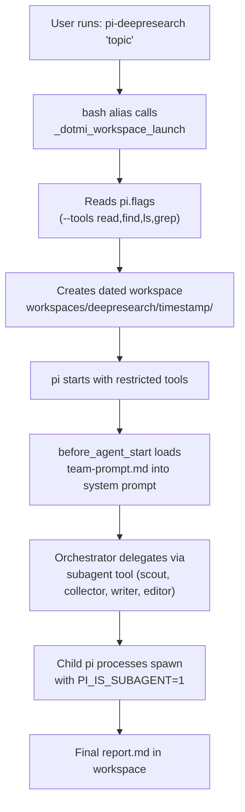
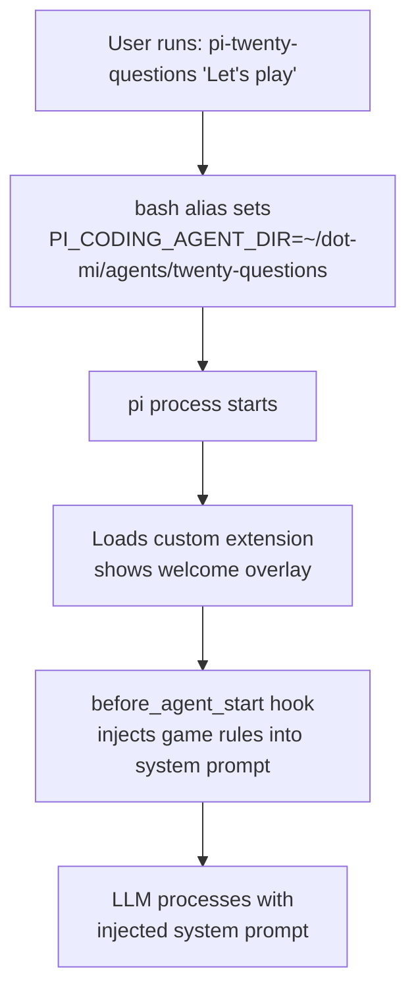

# Architecture

## The PI_CODING_AGENT_DIR Mechanism

pi resolves its config root via `getAgentDir()` in the coding-agent package. This function checks the `PI_CODING_AGENT_DIR` environment variable first. When set, **all** of pi's configuration loads from that directory instead of `~/.pi/agent/`:

- `extensions/` -- auto-discovered TypeScript extensions
- `agents/` -- agent definition markdown files
- `prompts/` -- prompt template files
- `skills/` -- skill definitions (SKILL.md files)
- `bin/` -- downloaded tool binaries (fd, rg)
- `sessions/` -- conversation history
- `settings.json` -- pi settings
- `models.json` -- custom model providers
- `auth.json` -- API authentication
- `team-prompt.md` -- orchestrator system prompt (loaded by the subagent-teams extension)
- `pi.flags` -- default CLI flags applied by bash_aliases (e.g. `--tools read,find,ls,grep`)
- `workspace.conf` -- workspace subdirectory list (triggers workspace mode in bash_aliases)

This is the mechanism dot-mi exploits for both team isolation and standalone agent configurations.

## Directory Layout

```
dot-mi/
├── setup.sh                  # Team and agent bootstrapping script
├── bash_aliases              # Shell aliases (source in .zshrc/.bashrc)
├── example.env               # API key template
├── AGENTS.md                 # LLM-readable project guide
├── shared/                   # Reusable resources (never loaded directly)
│   ├── extensions/
│   │   ├── subagent-teams/   # Team-aware subagent extension
│   │   ├── run-finish-notify.ts
│   │   └── startup-branding.ts  # Renders banner.txt as startup header
│   ├── skills/               # Shared skill definitions
│   │   ├── playwright/
│   │   ├── nak/
│   │   └── searxng/
│   ├── themes/               # Shared themes
│   │   └── synthwave.json
│   ├── bin/                  # Downloaded binaries (fd, rg) -- gitignored contents
│   └── models.json           # Custom model provider config
├── teams/                    # Multi-agent team directories
│   ├── recon/
│   │   ├── extensions/       # ← symlinks to shared/extensions/
│   │   ├── agents/           # recon-scout.md, recon-planner.md
│   │   ├── prompts/          # implement.md
│   │   ├── skills/           # ← individual symlinks to shared/skills/*/
│   │   ├── themes/           # ← individual symlinks to shared/themes/*
│   │   ├── team-prompt.md    # orchestrator system prompt (optional)
│   │   ├── banner.txt        # startup branding (ASCII art + usage)
│   │   ├── bin/              # ← symlink to shared/bin/
│   │   ├── sessions/         # runtime (gitignored)
│   │   ├── settings.json     # theme, quietStartup (gitignored)
│   │   └── models.json       # ← symlink to shared/models.json
│   ├── deepresearch/
│   │   ├── ...               # same structure as above
│   │   ├── workspace.conf    # triggers workspace mode (dated directories)
│   │   └── pi.flags          # restricts orchestrator tools
│   ├── impl/
│   └── blog/
├── agents/                   # Standalone agent directories
│   └── twenty-questions/
│       ├── extensions/       # Custom extension (not subagent-teams)
│       ├── themes/           # ← symlinks to shared/themes/*
│       ├── banner.txt        # startup branding (ASCII art + usage)
│       ├── sessions/         # runtime (gitignored)
│       └── settings.json     # theme, quietStartup (gitignored)
├── docs/                     # This documentation (MkDocs)
└── pi-mono/                  # Read-only reference submodule
```

## Data Flow



### Workspace Team Flow



### Standalone Agent Flow



See [Standalone Agents](standalone-agents.md) for details.

## Team-Level Configuration

### `team-prompt.md` -- Orchestrator System Prompt

If `<agentDir>/team-prompt.md` exists, the `subagent-teams` extension appends its contents to the orchestrator's system prompt via a `before_agent_start` hook. This gives the parent pi process team-specific context: what agents are available, recommended workflows, and behavioral constraints.

The injection is gated on `PI_IS_SUBAGENT` -- subagent child processes have `PI_IS_SUBAGENT=1` set in their environment by the extension, so they do not receive the team prompt. This works correctly for both interactive sessions and non-interactive runs (eval scripts, piped output).

### `pi.flags` -- Default CLI Flags

If `<teamDir>/pi.flags` exists, `bash_aliases` reads it and prepends the flags to the pi invocation. One flag per line; comments (`#`) and blank lines are ignored. User-provided flags come after and can override.

Example (`teams/deepresearch/pi.flags`):

```
--tools read,find,ls,grep
```

This restricts the orchestrator to read-only tools, forcing it to delegate all work through the `subagent` extension tool. Extension-registered tools (like `subagent`) are unaffected by `--tools`.

## Extension Architecture

The `subagent-teams` extension extends the upstream `subagent` example with team-based filtering:

### Agent Discovery

Agents are markdown files with YAML frontmatter. They're discovered from `<agentDir>/agents/` at each invocation. Teams are derived from:

1. **Filename convention**: `team-agentname.md` (first `-` separates team from name)
2. **Frontmatter override**: a `team` field takes precedence over filename

### Execution Modes

| Mode | Input | Behavior |
|------|-------|----------|
| **Single** | `{ agent, task, team? }` | One agent runs one task |
| **Parallel** | `{ tasks: [...], team? }` | Up to 8 tasks, 4 concurrent |
| **Chain** | `{ chain: [...], team? }` | Sequential pipeline; `{previous}` passes output forward |

### Prompt Templates

Prompt templates (`.md` files in `prompts/`) define reusable workflows. They can reference `$@` as a placeholder for user input and are invoked with `/template-name` syntax in the pi chat.

## Isolation Model

Each team and standalone agent directory is a complete pi config root. This provides:

- **Extension isolation** -- each team loads only its own extensions
- **Agent isolation** -- only the team's agents are visible to the LLM
- **Skill isolation** -- per-team via individual symlinks, per-agent via frontmatter (`skills`, `no-skills`)
- **Session isolation** -- separate conversation history per team
- **Settings isolation** -- per-team model preferences and configuration

Shared resources (extensions, skills, themes, models, binaries) are symlinked from `shared/` to avoid duplication while preserving isolation boundaries. Downloaded binaries (`fd`, `rg`) are written once to `shared/bin/` through directory symlinks and shared across all teams automatically. Individual agents can further restrict which skills they load via frontmatter. Orchestrator tools can be restricted per-team via `pi.flags` (e.g. removing `bash` to force subagent delegation).

For shared authentication across teams and agents, symlink `auth.json`:

```bash
./setup.sh link-auth recon blog
./setup.sh link-auth recon twenty-questions
```
