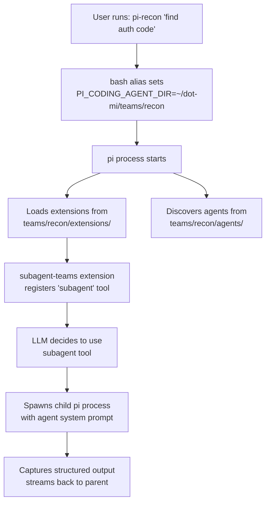

# Architecture

## The PI_CODING_AGENT_DIR Mechanism

pi resolves its config root via `getAgentDir()` in the coding-agent package. This function checks the `PI_CODING_AGENT_DIR` environment variable first. When set, **all** of pi's configuration loads from that directory instead of `~/.pi/agent/`:

- `extensions/` -- auto-discovered TypeScript extensions
- `agents/` -- agent definition markdown files
- `prompts/` -- prompt template files
- `skills/` -- skill definitions (SKILL.md files)
- `sessions/` -- conversation history
- `settings.json` -- pi settings
- `models.json` -- custom model providers
- `auth.json` -- API authentication

This is the mechanism dot-mi exploits for team isolation.

## Directory Layout

```
dot-mi/
├── setup.sh                  # Team bootstrapping script
├── bash_aliases              # Shell aliases (source in .zshrc/.bashrc)
├── example.env               # API key template
├── shared/                   # Reusable resources (never loaded directly)
│   ├── extensions/
│   │   ├── subagent-teams/   # Team-aware subagent extension
│   │   └── run-finish-notify.ts
│   ├── skills/               # Shared skill definitions
│   │   ├── bowser/
│   │   ├── nak/
│   │   └── searxng/
│   └── models.json           # Custom model provider config
├── teams/                    # One directory per team
│   ├── recon/
│   │   ├── extensions/       # ← symlinks to shared/extensions/
│   │   ├── agents/           # recon-scout.md, recon-planner.md
│   │   ├── prompts/          # implement.md
│   │   ├── skills/           # ← symlink to shared/skills/
│   │   ├── sessions/         # runtime (gitignored)
│   │   └── models.json       # ← symlink to shared/models.json
│   ├── impl/
│   └── blog/
├── docs/                     # This documentation (MkDocs)
└── pi-mono/                  # Read-only reference submodule
```

## Data Flow



## Extension Architecture

The `subagent-teams` extension extends the upstream `subagent` example with team-based filtering:

### Agent Discovery

Agents are markdown files with YAML frontmatter. They're discovered from `<agentDir>/agents/` at each invocation. Teams are derived from:

1. **Filename convention**: `team-agentname.md` (first `-` separates team from name)
2. **Frontmatter override**: a `team` field takes precedence over filename

### Execution Modes

| Mode | Input | Behavior |
|------|-------|----------|
| **Single** | `{ agent, task, team? }` | One agent runs one task |
| **Parallel** | `{ tasks: [...], team? }` | Up to 8 tasks, 4 concurrent |
| **Chain** | `{ chain: [...], team? }` | Sequential pipeline; `{previous}` passes output forward |

### Prompt Templates

Prompt templates (`.md` files in `prompts/`) define reusable workflows. They can reference `$@` as a placeholder for user input and are invoked with `/template-name` syntax in the pi chat.

## Isolation Model

Each team directory is a complete pi config root. This provides:

- **Extension isolation** -- each team loads only its own extensions
- **Agent isolation** -- only the team's agents are visible to the LLM
- **Skill isolation** -- per-agent skill selection via frontmatter (`skills`, `no-skills`)
- **Session isolation** -- separate conversation history per team
- **Settings isolation** -- per-team model preferences and configuration

Shared resources (extensions, skills, models) are symlinked from `shared/` to avoid duplication while preserving isolation boundaries. Individual agents can further restrict which skills they load via frontmatter.

For shared authentication across teams, symlink `auth.json`:

```bash
./setup.sh link-auth recon blog
```
