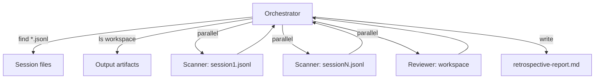

# Retro Team

Retrospective trajectory analysis for pi agent runs. Analyzes JSONL session traces and workspace output files to check procedural compliance -- did the agent follow instructions, use tools correctly, dispatch subagents appropriately, and avoid loops or errors?

Produces a structured `retrospective-report.md` designed for consumption by a frontier model, enabling cost-effective quality assurance: the token-heavy parsing runs on a free open-source model, and only the concise report gets sent to a paid model for deeper analysis.

## Orchestrator

The orchestrator has restricted tools (`read,find,ls,grep,write` via `team-prompt.md` frontmatter). It cannot run `bash` directly -- all jq/grep-based JSONL parsing is delegated to the scanner subagent. The orchestrator surveys the workspace, dispatches subagents, and synthesizes findings into the final report.

## Agents

### scanner

| Field | Value |
|-------|-------|
| Tools | bash, read, grep |
| Skills | none (`no-skills: true`) |

Analyzes a single JSONL session file for procedural issues. Uses jq and grep one-liners to extract session profiles, tool call patterns, error states, and loop detection. Returns a structured profile + issue list per session file. One scanner is dispatched per session file, running in parallel when multiple files exist.

### reviewer

| Field | Value |
|-------|-------|
| Tools | read, find, ls, grep |
| Skills | none (`no-skills: true`) |

Inspects workspace output files for completeness and instruction adherence. Checks whether expected deliverables were created, files are non-empty, structure matches instructions, all task parts are addressed, sources are referenced, and no truncation or placeholder text exists. Returns a PASS/FAIL checklist.

The reviewer does NOT evaluate writing quality, style, or factual accuracy.

## Workflow



1. **Survey**: Find all `*.jsonl` session files and inventory workspace output artifacts
2. **Extract task**: Grep the first user message from the main session to understand what was asked
3. **Dispatch**: Scanner(s) + reviewer run in parallel
4. **Synthesize**: Merge all findings into `retrospective-report.md`

## Report Format

The output report has these sections:

- **Metadata** -- workspace path, session count, timestamp
- **Summary** -- issue counts by severity, output check pass/fail tally
- **Process Findings** -- CRITICAL/WARNING/INFO issues from scanner(s) with entry IDs and evidence
- **Output Review** -- file inventory, PASS/FAIL checklist, and output issues from the reviewer
- **Token Usage Summary** -- aggregate token counts and costs
- **Session Profiles** -- per-session message counts, tool usage, stop reasons, timing

## Usage

The retro team runs in-situ. `cd` into the workspace directory to analyze, then run `pi-retro`:

```bash
cd workspaces/deepresearch/2026-04-12-150258
pi-retro
```

The orchestrator treats the current directory as the workspace. It finds session files, dispatches analysis, and writes `retrospective-report.md` in the current directory.

### Frontier model handoff

The report is designed to be fed to a frontier (paid) model for deeper analysis:

```bash
cd workspaces/deepresearch/2026-04-12-150258

# Step 1: Run retro (free, on open-source model)
pi-retro

# Step 2: Feed the report to a frontier model for actionable recommendations
pi-recon "Read retrospective-report.md and suggest specific fixes for each issue found"
```

## Configuration

All configuration is in `team-prompt.md` YAML frontmatter:

```yaml
---
name: Retro
description: Retrospective trajectory analysis. Run from inside a workspace directory.
tools: read, find, ls, grep, write
---
```

The body of `team-prompt.md` provides the orchestrator's system prompt with team context and workflow instructions.
